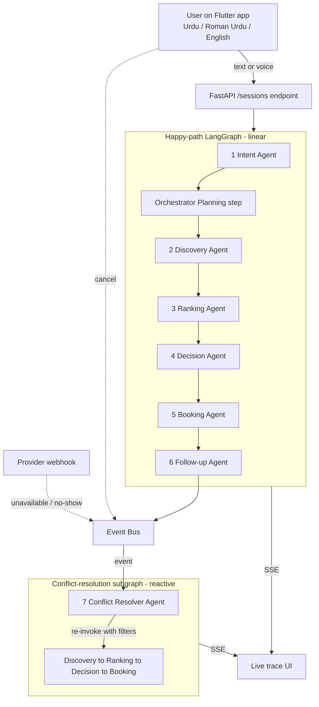

# Karigar: Detailed README

> This is the **hackathon-deliverable README**. It contains the four sections the brief specifically requires: system architecture, how Antigravity is used, APIs/tools used and assumptions/limitations. For the project landing page, see [`/README.md`](../README.md).

## Table of contents

1. [Quickstart](#1-quickstart)
2. [System architecture](#2-system-architecture)
3. [How Antigravity is used](#3-how-antigravity-is-used)
4. [APIs and tools used](#4-apis-and-tools-used)
5. [Assumptions and limitations](#5-assumptions-and-limitations)

---

## 1. Quickstart

### Prerequisites

- **Python 3.11** (managed automatically by `uv`)
- **Flutter 3.x** (with an Android emulator / iOS simulator / a device)
- **[uv](https://docs.astral.sh/uv/)**: `winget install astral-sh.uv` on Windows, `brew install uv` on macOS
- A **Google AI Studio API key** for Gemini (free tier is enough for the demo).
  Get one at https://aistudio.google.com/apikey

### Environment

```bash
cp .env.example .env
# then edit .env and fill in at minimum:
#   GOOGLE_API_KEY=...
```

### Backend

```bash
cd backend
uv sync                                      # install deps from pyproject.toml + uv.lock
uv run python -m app.data.seed               # seed providers.json + SQLite
uv run python -m uvicorn app.main:app --reload --host 127.0.0.1 --port 8000
```

Health check:
```bash
curl http://localhost:8000/health
```

Try the canonical query:
```bash
curl -X POST http://localhost:8000/sessions \
  -H "Content-Type: application/json" \
  -d '{"user_id":"demo","raw_text":"Mujhe kal subah G-13 mein AC technician chahiye"}'
```

Stream the agent trace:
```bash
curl http://localhost:8000/sessions/<session_id>/stream
```

### Mobile

```bash
cd mobile
flutter pub get
flutter run                                  # picks the first connected device
```

The Flutter app expects the backend at `http://10.0.2.2:8000` on Android emulator (host machine's loopback). Override with `--dart-define=API_BASE_URL=...` when running on a real device.

### Run all tests

```bash
cd backend
uv run python -m pytest -v
```

Or use the Antigravity workflow: `/run-e2e`.

---

## 2. System architecture

Karigar is a multi-agent orchestration system. The mobile app sends a natural-language request, the backend's LangGraph state machine runs the user through an explicit **Plan → Decide → Act → Follow-up → Recover** loop across 7 specialised agents and the full trace streams back to the app in real time.



For the full architecture deep-dive (state contracts, tool protocols, event-bus internals and swap-to-real-APIs guide), see [`architecture.md`](architecture.md).

### The 7 agents at a glance

| # | Agent | Phase | What it does |
|---|---|---|---|
| 1 | IntentAgent | plan | Parses Urdu / Roman Urdu / English → typed `ParsedIntent` |
| — | Planning step (Orchestrator) | plan | Emits the 5-step execution plan to the trace |
| 2 | DiscoveryAgent | act | Geocoder + ProviderStore + optional Search-via-Antigravity-Browser |
| 3 | RankingAgent | decide | Weighted scoring: 0.4 proximity + 0.3 rating + 0.2 availability + 0.1 price |
| 4 | DecisionAgent | decide | Gemini picks top-N + writes user-facing justification in their language |
| 5 | BookingAgent | act | Atomic slot-hold → receipt → faux-WhatsApp |
| 6 | FollowupAgent | follow_up | APScheduler: T-1h reminder, T+15min no-show watchdog, T+2h completion |
| 7 | ConflictResolverAgent | recover | Reactive to 5 event types; re-invokes Discovery→Booking with exclusions |

### Trace shape (the rubric-critical artifact)

Every node emits an event with this exact shape: judges see Decisions, Tool usage and Action execution as separate labelled facets, mirroring the brief's language verbatim:

```json
{
  "step": 4,
  "agent": "DiscoveryAgent",
  "phase": "act",
  "input": {"location_hint": "G-13", "service": "ac_technician"},
  "output": {"candidate_count": 6},
  "tool_calls": [
    {"name": "Geocoder.resolve", "args": {"hint": "G-13"}, "result": {"lat": 33.65, "lng": 72.94}, "latency_ms": 12},
    {"name": "ProviderStore.search", "args": {"radius_km": 5}, "result": {"count": 6}, "latency_ms": 8},
    {"name": "Search.lookup", "args": {"name": "Ali AC Services"}, "result": {"snippets": [...]}, "latency_ms": 410}
  ],
  "latency_ms": 432,
  "reasoning": "Found 6 candidates within 5km of G-13; enriched top-3 with reputation snippets",
  "triggered_by": null
}
```

---

## 3. How Antigravity is used

Karigar uses Google Antigravity at **two layers**: this is the core of how we score on the 25% "Use of Google Antigravity" rubric criterion.

### Layer 1: Build-time orchestration

The entire repo is developed inside Antigravity. Specifically:

- **`agents.md`** at repo root defines five specialised AI dev agents (`product-architect`, `backend-engineer`, `flutter-engineer`, `qa-engineer` and `demo-ops`) so Antigravity spawns the right specialist per task instead of one generic agent.
- **`skills/`** holds six modular `.md` capability files (`multilingual-intent`, `langgraph-node-author`, `provider-ranking-rules`, `booking-simulator`, `conflict-resolution-policy` and `flutter-trace-ui`). Antigravity loads these on-demand (only when the relevant files are being edited) so context stays focused.
- **`workflows/`** exposes slash commands (`/seed-mock`, `/run-e2e`) that chain multiple agent invocations into autonomous pipelines.
- Every non-trivial change is made in **Planning mode**, producing Implementation Plans, Task Lists and Walkthrough Artifacts for human review.

### Layer 2: Runtime orchestration

This is what makes Antigravity *central to system logic*, not just a code editor:

- The backend's **`Search` tool** (`backend/app/tools/search.py`) is a thin wrapper that invokes Antigravity's **Browser subagent** at runtime. The DiscoveryAgent calls it to enrich high-uncertainty candidates with reputation snippets and verify business hours: exactly the brief's "tools integration (Maps, Search, APIs)" requirement.
- The deployed agent graph mirrors Antigravity's Mission Control metaphor: each LangGraph step renders as a "trace card" in the Flutter app, complete with phase badges, named tool-call chips and latency indicators.

### Layer 3: Deliverables produced by Antigravity

- The 3–5 min **demo video** is recorded through Antigravity's Browser subagent, so the deliverable itself is an Antigravity Artifact.
- The **agent trace** export (`GET /sessions/{id}/trace.md`) is published alongside Antigravity's own Walkthrough and Implementation Plan artifacts as the "Agent Trace / Logs" submission.

---

## 4. APIs and tools used

### LLM
- **Google Gemini 2.5 Flash**: all nodes (IntentAgent, DecisionAgent, ConflictResolverAgent, Search summarisation)
- Accessed via `langchain-google-genai` with structured output (Pydantic schema)
- **`DEMO_MODE=true`** activates a cache in `backend/app/graph/demo_cache.py` that returns
  deterministic responses for the 5 canonical demo prompts (Intent + Decision + Conflict)
  without burning Gemini quota. Unknown prompts still fall through to the live API.

### Agent orchestration
- **LangGraph 1.x**: state machine, conditional routing, subgraph re-invocation
- **Google Antigravity Browser subagent**: runtime Search tool + demo recorder

### Maps and geocoding
- **Mock** (default, no API key needed): hand-coded Islamabad sector lookup + haversine distance
- **Real (drop-in)**: Google Maps Platform: Geocoding API, Places API (Nearby Search), Distance Matrix API. Activated by setting `GOOGLE_MAPS_KEY` in `.env`.

### Backend
- **FastAPI**: HTTP/SSE server
- **sse-starlette**: Server-Sent Events for the live trace
- **SQLAlchemy + SQLite (aiosqlite)**: bookings, agent_traces, conflict_events tables
- **APScheduler**: reminder / no-show watchdog / completion jobs
- **Pydantic v2**: typed state objects and LLM structured outputs

### Mobile
- **Flutter 3.x** with `dio`, `flutter_sse`, `speech_to_text` (ur-PK locale), `flutter_tts`, `flutter_local_notifications`, `google_maps_flutter` (optional) and `riverpod`

### Dev tooling
- **uv**: Python project + virtualenv + lockfile management
- **ruff**: linter / formatter
- **pytest** + `pytest-asyncio`: test suite

---

## 5. Assumptions and limitations

- **Provider data is fully synthetic**: 25 mock providers across Islamabad. No real businesses are listed.
- **All phone numbers and addresses are placeholders**: numbers follow the realistic Pakistani
  `03XX-XXXXXXX` shape but are randomly generated with a fixed seed (any resemblance to
  real numbers is incidental). Addresses are sector-level only. PII-free per brief
  requirement: *"Avoid use of real personal/sensitive data."*
- **WhatsApp confirmations are simulated** inside the app on a faux-WhatsApp screen. No real WhatsApp Business API integration.
- **Follow-up timing is compressed** via the `DEMO_TIME_SCALE` env var for live demonstration. In production, `DEMO_TIME_SCALE=1` for real-time scheduling.
- **Urdu speech-to-text accuracy** depends on device locale. We ship text input as the primary input method and voice as a bonus.
- **No payments handled**: bookings include a price estimate only.
- **Conflict resolution is capped at 3 auto-rebook attempts** before handing off to the user with the top-3 alternatives. This prevents infinite loops on correlated failures.
- **Google Maps APIs are optional**: the system fully functions on mock data without any API key. Real APIs are a drop-in via env var, demonstrating clean architecture (rubric criterion 5).
- **Gemini API quota** during the demo is mitigated via a `DEMO_MODE` cache (see
  `backend/app/graph/demo_cache.py`) that returns deterministic responses for the 5
  canonical demo prompts; unknown prompts still fall through to the live LLM.
- **No user authentication**: onboarding accepts a display name only. A production version would require phone-OTP auth.
- **Single-region**: sector lookup tables are Islamabad-only. Extending to Lahore, Karachi etc. is purely a data exercise.
