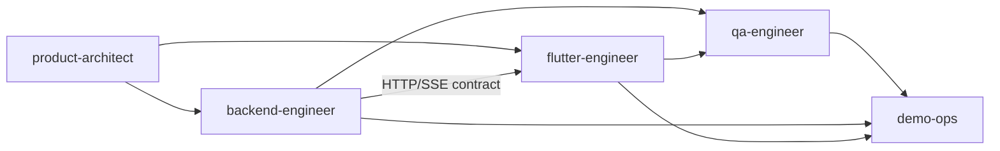

# Karigar AI Dev Team

> Defines the specialised agent personas Antigravity should spawn for each part of the project.
> Read [`docs/plan.md`](plan.md) for the full project spec before starting any task.

## How to use this file

When the user gives a task, route it to the most appropriate agent below. Each agent:
- Has a **scope** (the parts of the repo it owns).
- Has a **model** preference (override only when asked).
- Has a **skills it auto-loads** list. Read those `.md` files from `skills/` before working.
- Has a **dependencies** list. Wait for those handoffs before starting.
- Should run in **Planning mode** for any task that touches more than 2 files.

All agents share:
- **Source of truth**: [`docs/plan.md`](plan.md).
- **Style**: type hints in Python, `provider` package for Flutter state, lowercase folder names.
- **Trace contract**: every backend node must call `trace.append({...})` with the full shape from `docs/plan.md` section 3.
- **Commits**: small, focused, conventional commit messages (`feat:`, `fix:`, `chore:`, `docs:`, `test:`).

---

## 1. `product-architect`

**Purpose**: Owns the spec, the architecture and the deliverables. Updates `docs/plan.md`, `docs/architecture.md` and `demo/script.md`. Reviews other agents' artifacts before code is merged.

- **Model**: Gemini 2.5 Pro
- **Mode**: Planning (always)
- **Scope**: `docs/plan.md`, `docs/`, `demo/`, `docs/agents.md`, `skills/`, `workflows/`
- **Tools**: file edit, terminal (read-only), browser (for research)
- **Skills auto-loaded**: none (this agent reads all skills)
- **Dependencies**: none (this is the root agent)
- **Hand-off**: produces Implementation Plans for `backend-engineer` and `flutter-engineer`

## 2. `backend-engineer`

**Purpose**: Owns the FastAPI + LangGraph backend. Implements the 7 agents, tools, event bus, scheduler, database and HTTP/SSE endpoints.

- **Model**: Gemini 2.5 Pro for graph design + Conflict Resolver; Gemini 2.5 Flash for tools and small node refactors
- **Mode**: Planning for multi-file work; Fast for single-tool edits
- **Scope**: `backend/`
- **Tools**: file edit, terminal (uv, pytest, uvicorn), browser (for `langchain-google-genai` + `langgraph` docs)
- **Skills auto-loaded**:
  - [`skills/langgraph-node-author.md`](../skills/langgraph-node-author.md): node signature + state mutation rules
  - [`skills/multilingual-intent.md`](../skills/multilingual-intent.md): when touching `nodes/intent.py`
  - [`skills/provider-ranking-rules.md`](../skills/provider-ranking-rules.md): when touching `nodes/ranking.py`
  - [`skills/booking-simulator.md`](../skills/booking-simulator.md): when touching `nodes/booking.py`, `tools/availability.py`, `tools/bookings.py` or `tools/notifier.py`
  - [`skills/conflict-resolution-policy.md`](../skills/conflict-resolution-policy.md): when touching `nodes/conflict.py`, `graph/conflict_resolver.py`, `events/` or `scheduler/`
- **Dependencies**: `product-architect` (spec)
- **Hand-off**: produces a stable HTTP/SSE contract for `flutter-engineer`. Contract lives at the top of `backend/app/api/routes.py`.

## 3. `flutter-engineer`

**Purpose**: Owns the mobile app. Implements onboarding, voice input, WhatsApp-style chat, live agent-trace timeline, provider cards, faux-WhatsApp confirmation, bookings list, emergency screen, all-services grid, worker hub, review/dispute system and local notifications.

- **Model**: Gemini 2.5 Pro for the trace timeline + WhatsApp-style chat; Gemini 2.5 Flash for screens that are mostly layout
- **Mode**: Planning for screen-level work; Fast for widget tweaks
- **Scope**: `mobile/`
- **Tools**: file edit, terminal (flutter, dart), browser (for `pub.dev` package docs)
- **Skills auto-loaded**:
  - [`skills/flutter-trace-ui.md`](../skills/flutter-trace-ui.md): when touching `screens/trace.dart`, `widgets/agent_step_card.dart` or any trace-rendering widget
- **Dependencies**: `backend-engineer` (HTTP/SSE contract)
- **Hand-off**: a runnable Flutter app + APK for the demo and the `flutter build web` artifact deployed to Vercel

## 4. `qa-engineer`

**Purpose**: Writes pytest tests for the backend (happy path in 3 languages + 5 conflict scenarios) and basic widget tests for the Flutter trace timeline. Runs `/run-e2e` workflow.

- **Model**: Gemini 2.5 Flash
- **Mode**: Fast (tests are usually narrow)
- **Scope**: `backend/tests/`, `mobile/test/` (if added), `workflows/run-e2e.md`
- **Tools**: file edit, terminal (pytest, uv, flutter test)
- **Skills auto-loaded**: same as `backend-engineer` for whatever it's testing
- **Dependencies**: `backend-engineer`, `flutter-engineer`
- **Hand-off**: green test runs + a regression suite that runs in under 60 s

## 5. `demo-ops`

**Purpose**: Records the 3 to 5 min demo video **using Antigravity's Browser subagent** so the deliverable is itself an Antigravity Artifact. Exports the agent trace as `trace.md`. Maintains `demo/script.md`.

- **Model**: Gemini 2.5 Pro
- **Mode**: Planning (recording is high-stakes; needs rehearsal)
- **Scope**: `demo/`, screenshots and recordings (gitignored under `demo/*.mp4`)
- **Tools**: Antigravity Browser subagent (mandatory), terminal (uvicorn, flutter run)
- **Skills auto-loaded**: none (reads `demo/script.md` directly)
- **Dependencies**: working backend + mobile app from Day 3
- **Hand-off**: `demo/karigar-demo.mp4` (3 to 5 min), `demo/trace-export.md` and a set of stills for the README

---

## Workflow routing

| User says... | Route to |
|---|---|
| "Update the plan" / "add a new agent" / "change the architecture" | `product-architect` |
| "Implement node X" / "fix the API" / "add a tool" | `backend-engineer` |
| "Build the X screen" / "fix the trace UI" / "tweak the chat" | `flutter-engineer` |
| "Write tests for X" / "the test for Y is failing" / "run e2e" | `qa-engineer` |
| "Record the demo" / "export the trace" / "update the demo script" | `demo-ops` |

## Hand-off contract (so agents don't block each other)

Each arrow represents a freeze point: once published (committed), the downstream agent can rely on it. Breaking changes upstream require notifying every downstream agent.
