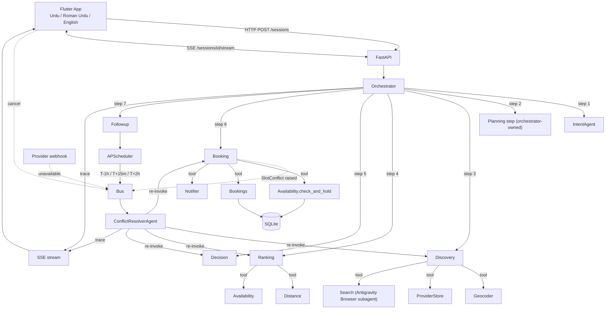
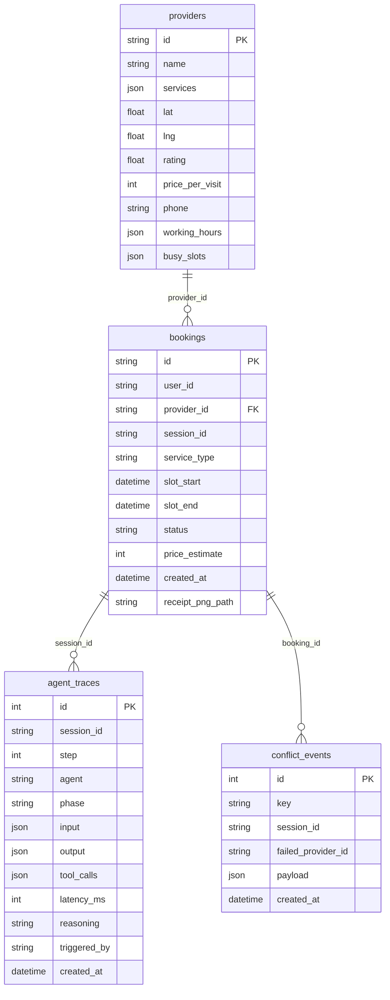

# Karigar: Architecture Deep-Dive

> Detailed technical reference for engineers working in the repo.
> For project intro, see [`/README.md`](../README.md). For the spec, see [`/plan.md`](../plan.md). For the brief-deliverable README, see [`README.md`](README.md).

## 1. System diagram



## 2. State contract (`RequestSession`)

The single shared object every node reads/writes. Lives in `backend/app/graph/state.py`.

```python
class RequestSession(BaseModel):
    id: str                                          # session ulid
    user_id: str
    user_phone: str
    raw_text: str

    parsed_intent: Optional[ParsedIntent] = None

    candidates: list[Provider] = []                  # written by Discovery
    ranked: list[RankedCandidate] = []               # written by Ranking
    chosen: Optional[RankedCandidate] = None         # written by Decision
    booking: Optional[Booking] = None                # written by Booking

    trace: list[TraceEvent] = []                     # append-only

    # Conflict-resolution state
    excluded_provider_ids: list[str] = []            # append-only
    resolution_attempts: int = 0
    triggered_by: Optional[str] = None               # e.g. "no_show_detected:provider_42"

    # Snapshot of the user's original window at first conflict so the resolver
    # widens *relative to it* (rather than cumulatively widening the already-
    # widened window each retry).
    original_time_window: Optional[TimeWindow] = None

    created_at: datetime = Field(default_factory=lambda: datetime.now(ZoneInfo("Asia/Karachi")))
```

Persistence: sessions are kept in-memory during a single graph run. After completion, the trace is durable in the `agent_traces` table; the session itself is discarded. The Conflict Resolver reconstructs the session from `agent_traces` + `bookings` + `conflict_events` when an event fires.

## 2a. Repository layout: `app/data/` vs `runtime/`

The backend has two folders that look similar but serve completely different
purposes. The split is deliberate and load-bearing:

| Path | Purpose | Versioned? | Touched by |
|---|---|---|---|
| `backend/app/data/` | **Source data** that ships with the app: `providers.json` (the 25 seed providers), `seed.py` (the seeder script). Importable as a Python package. | YES | Edited by devs; read by `JsonProviderStore` and `seed.py` |
| `backend/runtime/` | **Runtime output** generated at boot/runtime: `karigar.db` (SQLite), `notifier-log.jsonl` (mock WhatsApp messages), `receipts/*.png`, `seed-report.md`, `traces/*.md` (e2e exports). | **NO** (gitignored in `.gitignore`) | Written by the backend at runtime; safe to delete |

`backend/runtime/` is wiped by the `/seed-mock` workflow and is regenerated
on every fresh run. If you ever see code referencing `data/karigar.db`
(without the `runtime/` prefix) it's a bug — older versions of the project
used a single `backend/data/` folder for both source and runtime, which was
confusing.

## 3. Tool protocols (swappable)

`backend/app/tools/__init__.py` defines `typing.Protocol` interfaces. Each protocol has a mock and (optionally) a real Google-API implementation. The active implementation is chosen at startup based on env vars.

```python
class Geocoder(Protocol):
    async def resolve(self, hint: str) -> GeoPoint: ...

class ProviderStore(Protocol):
    async def search(
        self, service: ServiceType, lat: float, lng: float,
        radius_km: float, exclude: list[str],
    ) -> list[Provider]: ...

class Distance(Protocol):
    async def km(self, a: GeoPoint, b: GeoPoint) -> float: ...

class Availability(Protocol):
    async def check_and_hold(
        self, provider_id: str, slot_start: datetime,
        slot_end: datetime, user_id: str,
    ) -> Booking: ...

class Notifier(Protocol):
    async def send(self, channel: str, to: str, message: str) -> None: ...

class Search(Protocol):
    async def lookup(self, query: str) -> list[SearchSnippet]: ...
```

### Implementations

| Protocol | Mock | Real |
|---|---|---|
| Geocoder | `MockGeocoder`: Islamabad sector lookup table | `GoogleGeocoder`: Geocoding API |
| ProviderStore | `JsonProviderStore`: reads `app/data/providers.json` (source data, versioned) | `GooglePlacesStore`: Places Nearby Search |
| Distance | `HaversineDistance` | `GoogleDistanceMatrix` |
| Availability | `SqliteAvailability` (the only impl: uses DB at `runtime/karigar.db`) | (same) |
| Notifier | `MockNotifier`: appends to `runtime/notifier-log.jsonl` and exposes `GET /notifier-log` for the Flutter app | (no real backend; WhatsApp Business API would replace this) |
| Search | `AntigravityBrowserSearch` (default) | `GeminiGroundedSearch` (fallback when running outside Antigravity) |

### Selecting an implementation

`backend/app/config.py`:
```python
class Settings(BaseSettings):
    google_api_key: str
    google_maps_key: str = ""
    use_real_maps: bool = False         # auto-true when google_maps_key is set
    demo_mode: bool = False
    demo_time_scale: int = 1
```

`backend/app/tools/__init__.py::build_tools(settings)` returns a `Tools` dataclass with the selected impls.

## 4. Event bus

In-process pub/sub. Lives in `backend/app/events/bus.py`.

```python
class EventBus:
    async def publish(self, key: str, payload: dict) -> None: ...
    def subscribe(self, key: str, handler: Callable[[dict], Awaitable[None]]) -> None: ...
```

Events published:
| Key | Source | Payload |
|---|---|---|
| `no_show_detected` | scheduler/reminders.py | `{session_id, failed_provider_id, booking_id}` |
| `user_cancellation` | api/routes.py | `{session_id, failed_provider_id, booking_id, rebook: bool}` |
| `provider_unavailable` | api/routes.py | `{session_id, failed_provider_id, booking_id}` |
| `slot_conflict` | graph/nodes/booking.py | `{session_id, failed_provider_id}` |
| `reschedule_requested` | api/routes.py | `{session_id, new_time_window}` |

The Conflict Resolver subscribes to all five and dispatches them through a single `handle(event)` entry point.

Events are also written to the `conflict_events` table for the trace export.

## 5. Database schema



The critical constraint: `UNIQUE(provider_id, slot_start)` on `bookings`. This is the entire atomic-hold mechanism.

## 6. HTTP / SSE contract

| Method | Path | Body | Returns |
|---|---|---|---|
| `POST` | `/sessions` | `{user_id, raw_text}` | `{session_id, status}` |
| `GET` | `/sessions/{id}` | - | full session snapshot |
| `GET` | `/sessions/{id}/stream` | - | SSE stream of `TraceEvent` until terminal step |
| `GET` | `/sessions/{id}/trace.md` | - | Markdown export of the trace |
| `GET` | `/bookings` | - | List bookings for the current user |
| `POST` | `/bookings/{id}/cancel?rebook={true|false}` | - | Cancels (and optionally rebooks) |
| `POST` | `/bookings/{id}/arrived` | - | Marks provider as arrived (cancels watchdog) |
| `POST` | `/bookings/{id}/complete` | - | Marks `COMPLETED` |
| `POST` | `/providers/{id}/unavailable` | `{session_id}` | Triggers proactive conflict |
| `POST` | `/sessions/{id}/reschedule` | `{new_time_window}` | Publishes `reschedule_requested` |
| `GET` | `/receipts/{booking_id}.png` | - | The receipt PNG |
| `GET` | `/notifier-log` | - | Mock WhatsApp message log (for the faux-WhatsApp screen) |

### SSE event format

```
event: trace
data: {"step":4,"agent":"DiscoveryAgent","phase":"act",...}

event: trace
data: {"step":5,"agent":"RankingAgent","phase":"decide",...}

event: done
data: {"session_id":"...","status":"completed"}
```

## 7. Multilingual flow

Gemini 2.5 handles all three languages natively. No translation layer.

1. `IntentAgent` sets `parsed_intent.language` based on the input.
2. `DecisionAgent` and `ConflictResolverAgent` are instructed to respond *in `parsed_intent.language`*: their prompts include the language enum.
3. `Notifier` templates are indexed by language (`TEMPLATES["roman_ur"]`, `TEMPLATES["ur"]`, `TEMPLATES["en"]`).
4. Flutter wraps Urdu strings in `Directionality(textDirection: TextDirection.rtl)` and uses Noto Nastaliq Urdu for that script.

## 8. Demo-time scaling

`backend/app/scheduler/clock.py` exposes:
```python
def scaled_seconds(real_seconds: int) -> float:
    return real_seconds / max(settings.demo_time_scale, 1)
```

So `scaled_seconds(15 * 60)` returns 15 real seconds when `DEMO_TIME_SCALE=60` (1 real-second = 1 simulated-minute), and 900 real seconds in production.

Used in:
- `scheduler/reminders.py` when registering jobs
- `graph/conflict_resolver.py` when adding `asyncio.sleep` between trace events for demo pacing

## 9. Antigravity Browser subagent — Search tool

`backend/app/tools/search.py`:

```python
class AntigravityBrowserSearch:
    """Wraps the Antigravity Browser subagent. When running outside Antigravity,
    falls back to GeminiGroundedSearch.
    """
    async def lookup(self, query: str) -> list[SearchSnippet]:
        if running_inside_antigravity():
            # invokes Antigravity's runtime Browser API
            return await antigravity_browser.search(query, max_results=3)
        return await self._gemini_fallback(query)
```

Used by `DiscoveryAgent` for high-uncertainty candidates (e.g. a provider with rating in `[3.5, 4.0]` and no reviews in the mock dataset). Result snippets are appended to the candidate's `notes` so the DecisionAgent can cite them.

This is what makes Antigravity "central to runtime", not just dev: the brief's explicit requirement.

## 10. Where to look when something breaks

| Symptom | First place to look |
|---|---|
| IntentAgent returns `UNKNOWN` service_type | `skills/multilingual-intent.md` few-shots; check `parsed_intent.notes` |
| Wrong provider ranks first | `skills/provider-ranking-rules.md` formula; check sub-scores in the trace event |
| Booking fails with `SlotConflict` immediately | Mock data has overlapping `busy_slots`; re-run `/seed-mock` |
| No-show watchdog never fires | `DEMO_TIME_SCALE` not set; or APScheduler not started in `app/main.py::startup` |
| SSE stream cuts off | Reverse-proxy buffering: bypass `nginx` for `/sessions/*/stream` |
| Flutter shows English when user spoke Urdu | `parsed_intent.language` is being overwritten somewhere; trace each node's `output.language` |
| Resolution loop runs > 3 times | `state.resolution_attempts` isn't being persisted between event handlings; check `sessions.save` calls in `conflict_resolver.py` |
