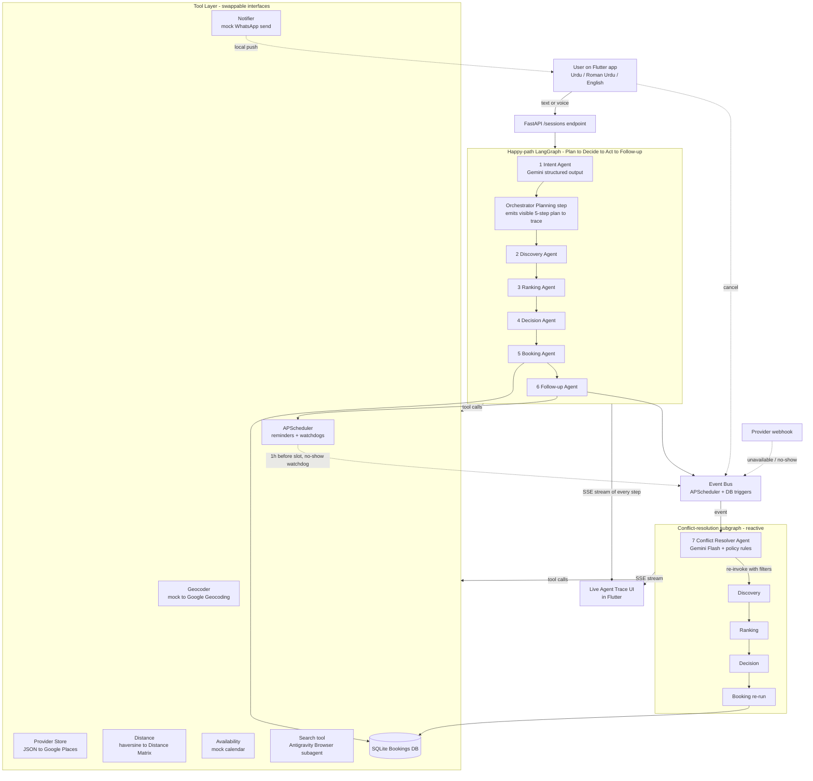

# Karigar: AI Service Orchestrator for Pakistan's Informal Economy

> The complete specification. Antigravity agents should treat this as the source of truth.
> Original hackathon brief lives in [`karigar.md`](karigar.md).

## 0. One-paragraph overview

**Karigar** is a multi-agent service-orchestration system for Pakistan's informal economy (plumbers, electricians, AC techs, tutors, beauticians etc.), built inside Google Antigravity. A Flutter mobile app (with optional web build) sends natural-language requests (Urdu / Roman Urdu / English) over a WhatsApp-style chat to a Python FastAPI backend that runs an explicit **Plan → Decide → Act → Follow-up → Recover** loop across 7 specialised LangGraph agents (Intent, Discovery, Ranking, Decision, Booking, Follow-up and Conflict Resolver). Tools include Maps (mock + real Google), a Search tool powered by the Antigravity Browser subagent and a mock notifier. Every agent step (including explicit `tool_calls`) is logged and streamed live to the app as an "agent trace", exactly the autonomy + reasoning evidence the rubric rewards.

## 1. How Google Antigravity is central (25% of the score)

Antigravity is used in **two layers**, not just as an editor:

### Build-time orchestration (the IDE itself)
- Entire repo developed inside Antigravity, using **Planning mode** to generate Implementation Plans, Task Lists and Walkthrough artifacts for every milestone.
- An `agents.md` at repo root defines our AI dev team (Product Architect, Backend Engineer, Flutter Engineer, QA Engineer and Demo Ops) so Antigravity spawns the right specialist for each task.
- A `skills/` directory holds modular `.md` capability files (`multilingual-intent`, `langgraph-node-author`, `provider-ranking-rules`, `booking-simulator`, `conflict-resolution-policy` and `flutter-trace-ui`) which are loaded on-demand to avoid context bloat.
- A `workflows/` directory exposes slash commands (`/seed-mock`, `/run-e2e`) that chain agents into autonomous pipelines.

### Runtime orchestration (the product itself)
- The **Search tool** in the backend is a thin wrapper over Antigravity's Browser subagent. It is used by the DiscoveryAgent to enrich high-uncertainty candidates with reputation snippets and verify business hours. This proves Antigravity is doing **runtime** work, not just dev work.
- The deployed agent graph is authored, debugged, traced and demoed through Antigravity. Each LangGraph step is rendered as an Antigravity-style "trace card" in the mobile UI, mirroring the Mission Control metaphor.
- The 3-5 min demo video is recorded **through Antigravity's Browser subagent** so the deliverable itself is an Antigravity Artifact.

## 2. Architecture



## 3. The 7 agents (LangGraph nodes)

The system is **two subgraphs sharing one state object and one trace log**: a linear happy-path graph (agents 1 to 6) and an event-driven conflict-resolution graph (agent 7) that reuses nodes 2 to 5.

Shared state `RequestSession`:
```
user_id, raw_text, parsed_intent, candidates, ranked, chosen,
booking, trace[], excluded_provider_ids[], resolution_attempts (max 3)
```

### Happy-path agents

| # | Agent | Model | Role |
|---|---|---|---|
| 1 | **IntentAgent** | Gemini 2.5 Flash (structured output) | Detects language (ur / roman_ur / en), extracts `service_type`, `location_hint`, `time_window`, `urgency`, `notes`. |
| - | **Planning step** (Orchestrator, not a separate agent) | - | Emits a single `Plan` trace event with the literal 5 upcoming steps. Makes the brief-required *planning* phase visible. |
| 2 | **DiscoveryAgent** | (no LLM) | Calls `Geocoder.resolve` then `ProviderStore.search(exclude=excluded_provider_ids)`. May call `Search.lookup` (Antigravity Browser subagent) for reputation enrichment. |
| 3 | **RankingAgent** | (no LLM) | Pure-function scorer: `score = 0.4*proximity + 0.3*rating + 0.2*availability_fit + 0.1*price_fit`. Emits human-readable reasoning per candidate. |
| 4 | **DecisionAgent** | Gemini 2.5 Flash | Picks top-1 (or top-3 if uncertain) and writes a 1-sentence justification **in the user's language**. |
| 5 | **BookingAgent** | (no LLM) | Atomic `Availability.check_and_hold` → `Bookings.create` → receipt → `Notifier.send`. Raises `SlotConflict` on race → routes to Conflict Resolver. |
| 6 | **FollowupAgent** | (no LLM) | Schedules `reminder_T-1h`, `noshow_watchdog_T+15min`, `status_check_T+0`, `completion_request_T+2h`. |

### Reactive agent

**7. ConflictResolverAgent** (Gemini 2.5 Flash + policy rules): **not** part of the user-initiated graph. Subscribes to the event bus and activates on any of:
- `no_show_detected` (from `noshow_watchdog_T+15min`)
- `user_cancellation` (Flutter cancel button → `POST /bookings/{id}/cancel`)
- `provider_unavailable` (mock provider webhook `POST /providers/{id}/unavailable`)
- `slot_conflict` (raised by BookingAgent on atomic-hold failure)
- `reschedule_requested` (user picks a new time_window)

Its policy: load the original `parsed_intent`, add the failing provider to `excluded_provider_ids`, optionally widen `time_window` by 2 hours, then **re-invoke Discovery → Ranking → Decision → Booking** as a subgraph. The user sees a single notification in their language: *"Ali AC Services didn't confirm, we auto-booked Hassan Cooling Experts at 11:00 AM instead."* Every step is appended to the same `trace[]`.

### Trace event shape

Every node calls `trace.append(...)` with this shape, which explicitly separates the brief's three required log facets:

```
{
  step: int,
  agent: str,
  phase: "plan" | "decide" | "act" | "follow_up" | "recover",   # brief language
  input: dict,
  output: dict,
  tool_calls: [{name, args, result, latency_ms}],               # tool usage facet
  latency_ms: int,
  reasoning: str,                                                # decision facet
  triggered_by: str | null
}
```

## 4. Tech stack

- **Mobile**: Flutter 3.38+, Dart 3.10+: `provider` (state), `http` (API client), `google_maps_flutter` + `flutter_map` (mapping), `firebase_auth` + `firebase_messaging` (auth + push), `geolocator`, `image_picker`, `flutter_animate`, `google_fonts`, custom SSE client (`sse_stub.dart` / `sse_web.dart`).
- **Backend**: Python 3.11 (managed by `uv`), FastAPI, LangGraph, `langchain-google-genai`, Pydantic v2, SQLAlchemy + SQLite (aiosqlite), APScheduler and `sse-starlette`.
- **LLM**: Gemini 2.5 Flash (all nodes).
- **Tools**: Maps (mock + real Google Geocoding/Places/Distance Matrix behind `GOOGLE_MAPS_KEY`), **Search via Antigravity Browser subagent** and mock Notifier.
- **Dev + runtime platform**: Google Antigravity (Agent Manager (dev orchestration), Browser subagent (runtime Search + demo recorder) and Artifacts (deliverables)).

## 5. Repository layout

```
/README.md                # root landing page
/LICENSE                  # MIT
/karigar.md               # original hackathon brief
/plan.md                  # this file
/agents.md                # Antigravity AI dev team
/.env.example
/.gitignore

/skills/
  multilingual-intent.md
  langgraph-node-author.md
  provider-ranking-rules.md
  booking-simulator.md
  conflict-resolution-policy.md
  flutter-trace-ui.md

/workflows/
  seed-mock.md
  run-e2e.md

/backend/                 # uv project (Python 3.11)
  pyproject.toml
  uv.lock
  .python-version
  app/
    main.py
    config.py
    graph/
      state.py
      orchestrator.py
      conflict_resolver.py
      nodes/{intent,discovery,ranking,decision,booking,followup,conflict}.py
    events/
      bus.py
      handlers.py
    tools/
      __init__.py         # protocol definitions for swappable implementations
      geocoder.py
      providers.py
      distance.py
      availability.py
      bookings.py
      notifier.py
      search.py           # Antigravity Browser subagent wrapper
    data/                 # SOURCE data (versioned, immutable, importable)
      providers.json      # 25 PII-safe mock providers
      seed.py
    db/
      models.py           # bookings, agent_traces, conflict_events
      session.py
    api/
      routes.py           # POST /sessions, GET /sessions/{id}/stream,
                          # POST /bookings/{id}/cancel,
                          # POST /providers/{id}/unavailable
    scheduler/
      reminders.py
  runtime/                # RUNTIME output (gitignored, regenerated)
    karigar.db            # SQLite (created at boot)
    notifier-log.jsonl    # mock WhatsApp log
    receipts/<id>.png     # generated PNG receipts
    seed-report.md        # written by /seed-mock
    traces/<test>.md      # written by /run-e2e
  tests/
    test_happy_path.py
    test_conflict.py

/mobile/                  # Flutter app (package: karigar, id: com.karigar.karigar)
  pubspec.yaml
  pubspec.lock
  firebase.json
  lib/
    main.dart
    firebase_options.dart
    app/{routes,theme}.dart
    constants/app_colors.dart
    models/{agent_event,booking,provider_model}.dart
    providers/app_state.dart
    screens/
      splash_screen.dart          # onboarding entry point
      language_select_screen.dart
      role_selection_screen.dart
      home_screen.dart
      provider_selection_screen.dart   # recommendation
      provider_profile_screen.dart
      booking_confirmed_screen.dart    # confirmation
      booking_history_screen.dart      # bookings list
      live_tracking_screen.dart
      agent_trace_screen.dart          # mission control trace UI
      messages_screen.dart             # chat
      login_screen.dart
      phone_auth_screen.dart
      review_screen.dart
      dispute_screen.dart
      worker_hub_screen.dart
      worker_area_screen.dart
      worker_job_request_screen.dart
      worker_profile_setup_screen.dart
      worker_skill_selection_screen.dart
    services/
      api_client.dart             # KarigarApiClient, configurable base URL
      sse_stub.dart               # platform stub (native)
      sse_web.dart                # web SSE implementation
    widgets/
      animated_background.dart
      karigar_logo.dart
      karigar_screen_header.dart
  android/
  ios/
  assets/images/

/docs/
  README.md               # detailed setup + the 4 brief-required sections
  architecture.md         # deep-dive

/demo/
  script.md               # minute-by-minute demo plan
```

## 6. Mock dataset (synthetic / PII-safe)

`backend/app/data/providers.json`: 25 providers across Islamabad sectors (G-13, F-7, F-10, I-8, G-9, Bahria) covering 6 service categories (AC tech, plumber, electrician, tutor, beautician and carpenter). Each entry:
```
id, name, services[], lat, lng, rating (3.5-4.9),
price_per_visit, phone, working_hours, busy_slots[]
```

`services[]` values are stored as lower_snake_case identifiers (`"ac_technician"`,
`"plumber"`, …); these are machine-readable enum values used for matching, DB
queries and trace events. The user-facing form (`"AC Technician"`, `"Plumber"`)
is produced by `ServiceType.pretty_name` and used on the receipt, in the
faux-WhatsApp message and in the trace UI; the JSON values themselves are
never shown to the user.

The dataset is hand-tuned so the canonical query *"G-13 + AC technician + tomorrow morning"* deterministically returns **"Ali AC Services"**, matching the brief's example output exactly.

**PII compliance** (brief requirement: *"Avoid use of real personal/sensitive data"*):
- All names are clearly fictional (Ali AC Services, Hassan Cooling Experts, etc.).
- All phone numbers follow the realistic Pakistani `03XX-XXXXXXX` shape but are
  generated by a fixed-seed random script (see git history for the regenerator).
  Any collision with a real number is incidental; the businesses themselves are
  fictional.
- All addresses are sector-level only (no street numbers).
- No real user data is collected; onboarding accepts a display name only, no auth.

## 7. Swap to real APIs later (zero refactor)

Every tool implements a `Protocol` in `backend/app/tools/__init__.py`. Switching is one env var:
- `Geocoder` → `MockGeocoder` (sector lookup table) **or** `GoogleGeocoder`
- `ProviderStore` → `JsonProviderStore` **or** `GooglePlacesStore`
- `Distance` → `HaversineDistance` **or** `GoogleDistanceMatrix`

Highlighted in the README to score on rubric criterion 5 (Technical Implementation).

## 8. Multilingual handling

Gemini 2.5 understands Urdu and Roman Urdu natively, so no separate translation step is needed. The IntentAgent prompt includes 9 few-shot examples (3 per language). The DecisionAgent and ConflictResolverAgent are instructed to respond in `state.parsed_intent.language` so a Roman Urdu request gets a Roman Urdu confirmation. Voice input uses `speech_to_text` with `ur-PK` locale toggle.

## 9. Booking simulation (15% of the score)

- DB row inserted in `bookings` with status `CONFIRMED`.
- A PNG receipt generated server-side and returned to the app.
- A mock "WhatsApp" confirmation message rendered in a faux-WhatsApp screen inside the Flutter app.
- APScheduler fires `T-1h reminder`, `T+0 status check` and `T+2h completion request` (all visible on screen, sped up via `DEMO_TIME_SCALE`).

## 9b. Conflict resolution (the 7th agent in action)

Five scenarios are wired end-to-end, all observable in the live trace:

| Scenario | Trigger | Resolution |
|---|---|---|
| Provider no-show | `noshow_watchdog` fires at T+15 min | Exclude provider, re-rank, auto-rebook, notify |
| User cancellation | `POST /bookings/{id}/cancel?rebook=true` | Release slot, mark `CANCELLED`, optionally rebook |
| Provider last-minute unavailable | `POST /providers/{id}/unavailable` | Proactive same-flow |
| Double-booking race | `Availability.check_and_hold` UNIQUE constraint loss | Loser routes to resolver |
| Reschedule | User picks new `time_window` | Resolver widens search with new constraint |

**Demo plan**: with `DEMO_TIME_SCALE=60` (1 real-second = 1 simulated-minute), a fresh booking will trigger a no-show 15 seconds later, the resolver activates on stream and the Mission Control timeline updates with the recovery in real time. This is the single most rubric-friendly moment in the demo.

## 10. Agent trace / logs (mandatory deliverable)

- **Server-side**: every node writes a row to `agent_traces` and emits an SSE event with the explicit shape from Section 3.
- **Client-side**: Flutter renders a "Mission Control" timeline. Each card shows a phase badge (Plan/Decide/Act/Follow-up/Recover), agent icon, reasoning text, **tool-call chips** (named: `Geocoder`, `ProviderStore`, `Search`, `Distance`, `Availability`, `Bookings` and `Notifier`) and latency.
- **Export**: `GET /sessions/{id}/trace.md` returns a markdown artifact suitable for the deliverable.

## 10b. README content checklist (brief-required sections)

`docs/README.md` must contain these sections, in this order:
1. System architecture (with the Section 2 mermaid diagram)
2. How Antigravity is used (build-time + runtime + deliverables)
3. APIs / tools used
4. Assumptions and limitations (see 10c)

## 10c. Assumptions and Limitations (verbatim README section)

- Provider data is fully synthetic (25 mock providers); no real businesses are listed.
- All phone numbers follow Pakistani `03XX-XXXXXXX` format but are randomly generated
  with a fixed seed; addresses are sector-level placeholders. PII-free per brief.
- WhatsApp confirmations are simulated inside the app (faux-WhatsApp screen); no real WhatsApp Business API integration.
- Follow-up timing is compressed via `DEMO_TIME_SCALE` for live demonstration; production would use real-time scheduling.
- Urdu speech-to-text accuracy depends on device locale; text input is the primary, voice the bonus.
- Payments are not handled; bookings include a price estimate only.
- Conflict resolution caps at 3 auto-rebook attempts before handing off to the user.
- Google Maps APIs are integrated but optional; the system fully functions on mock data without any API key.
- Gemini API quota constraints are mitigated via a `DEMO_MODE` cache of 5 canonical demo inputs.

## 11. 4-day execution timeline (team of 2 to 4)

- **Day 1: Foundation**: install Antigravity, scaffold `agents.md` + 6 skills + 2 workflows, FastAPI + LangGraph skeleton, seed PII-safe `providers.json`, build `Geocoder` + `ProviderStore` + `Distance` + `Search` (Antigravity Browser subagent wrapper) tools with mock implementations, implement IntentAgent + Orchestrator Planning step + DiscoveryAgent and unit test with curl.
- **Day 2: Complete happy path**: Ranking + Decision + Booking + Follow-up nodes, SQLite + APScheduler, SSE streaming endpoint with the full trace shape (phase + tool_calls) and end-to-end CLI test covering all 3 languages.
- **Day 3a (morning): Conflict resolver**: event bus, ConflictResolverAgent subgraph, 5 scenario handlers, `DEMO_TIME_SCALE` flag and integration test that forces a no-show and verifies auto-rebook.
- **Day 3b (afternoon): Flutter mobile app**: onboarding, WhatsApp-style chat input (text + mic), live trace view consuming SSE with tool-call chips + phase badges, provider card, faux-WhatsApp confirmation, bookings list with cancel button, local notifications and hidden "Provider" tab to fire `unavailable` webhook for demo.
- **Day 4: Polish + demo + bonuses**:
  - **Required**: UI polish, optional Google Maps key swap-in to prove the interface works, record 3-5 min demo using the Antigravity Browser subagent (so the deliverable is an Antigravity Artifact, including the auto-rebook moment), finalise README + ARCHITECTURE and export agent trace artifacts.
  - **Bonus (skip if behind)**: `flutter build web` + deploy to Firebase Hosting / Vercel.

## 12. Scoring map

| Criterion | Weight | How we hit it |
|---|---|---|
| Antigravity use | 25% | `agents.md` + 6 skills + 2 workflows + Artifacts + Browser subagent at **both** dev-time and runtime (Search tool + demo recorder) + Planning mode commits. |
| Agentic reasoning | 20% | 7 agents across a linear happy-path graph **and** an event-driven reactive subgraph; explicit and visible Plan → Decide → Act → Follow-up → Recover phases (each trace card is labelled with one); full trace streamed live. |
| Matching quality | 20% | Weighted-score ranking with per-candidate reasoning + DecisionAgent justification; re-ranking on conflict events proves criteria hold under stress. |
| Action simulation | 15% | DB row + receipt + faux-WhatsApp + scheduled reminders firing on screen + auto-rebook simulation. |
| Technical | 10% | Swappable tool interfaces (Protocols), typed Pydantic state, SSE streaming with explicit `tool_calls` field, atomic slot-hold via DB constraint, tests including conflict scenarios, PII-safe synthetic data. |
| Innovation + UX | 10% | WhatsApp-style chat input, voice input in Urdu, faux-WhatsApp confirmation, live Mission-Control-style trace UI with named tool-call chips, multilingual responses and **autonomous recovery from real-world failures** (the differentiator most teams will miss). |

## 13. Risks + mitigations

- **Gemini quota during demo** → `DEMO_MODE` cache of 5 canonical demo inputs.
- **Flutter SSE quirks** → fallback to polling `GET /sessions/{id}/trace` every 500 ms.
- **Speech-to-text Urdu accuracy** → text input is primary, voice is bonus; pre-record a clean Urdu voice clip for the demo.
- **Antigravity preview limits** → `agents.md` + skills setup that can also be replayed manually.
- **Conflict resolver infinite loop** → `max_resolution_attempts=3` cap; after that, hand off to the user with the top-3 alternatives.
