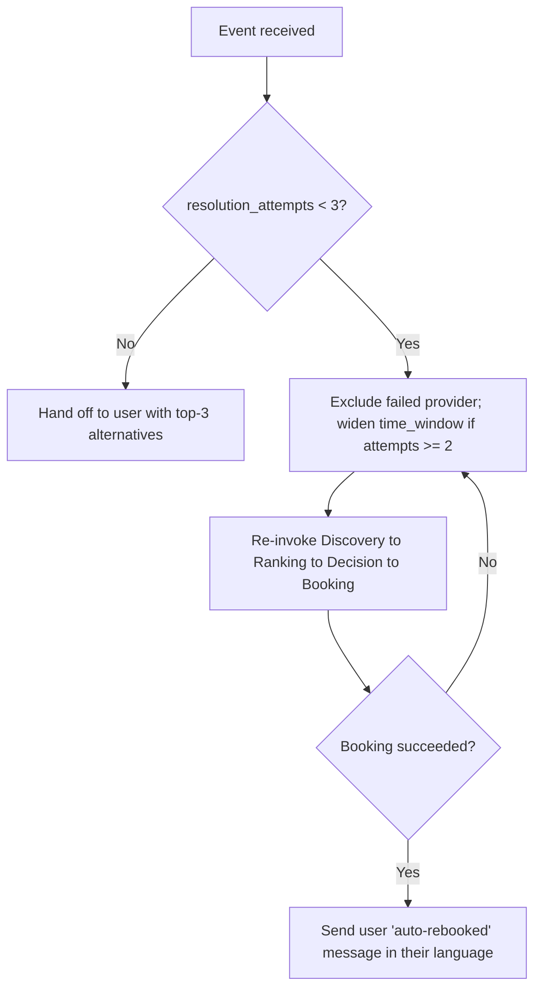

# Skill: Conflict Resolution Policy

> Load this skill when working on `backend/app/graph/conflict_resolver.py`, `nodes/conflict.py`, `events/` or `scheduler/reminders.py`.
> Owner: `backend-engineer`.

## Purpose

Make the system autonomous when real-world failures happen (no-shows, cancellations, double-bookings, provider drop-outs). This is the agentic-reasoning differentiator most teams won't have.

## The 5 scenarios

| # | Event | Source | Resolver action |
|---|---|---|---|
| 1 | `no_show_detected` | APScheduler `noshow_watchdog_T+15min` | Exclude provider, re-rank, auto-rebook within the same time_window; notify user in their language. |
| 2 | `user_cancellation` | `POST /bookings/{id}/cancel?rebook=true` | Release slot. If `rebook=true`, treat like a no-show (exclude original, find next). |
| 3 | `provider_unavailable` | `POST /providers/{id}/unavailable` (proactive) | Same as no-show, but **before** the watchdog fires. |
| 4 | `slot_conflict` | BookingAgent caught `SlotConflict` from `UNIQUE` constraint | Exclude that provider (or, for true races, keep them and just pick a different slot 30 min later); re-run from Discovery. |
| 5 | `reschedule_requested` | User picks a new `time_window` in the app | Reload `parsed_intent`, replace `time_window`, do NOT exclude any provider; re-run Discovery → Ranking → Decision → Booking. |

## State delta (what the resolver mutates)

```python
class RequestSession(BaseModel):
    ...
    excluded_provider_ids: list[str] = []
    resolution_attempts: int = 0
    triggered_by: Optional[str] = None    # e.g. "no_show_detected:provider_42"
```

Rules:
- **Always** append the failing provider to `excluded_provider_ids`. Never replace.
- **Always** increment `resolution_attempts`.
- **Always** set `triggered_by` to the event key so downstream nodes know they're in `recover` phase.

## The hard cap

```python
MAX_RESOLUTION_ATTEMPTS = 3
```

After 3 failed auto-rebooks, the resolver:
1. Emits a final `recover` trace event with `reasoning="exhausted auto-rebook attempts"`.
2. Sends the user a notification: *"We couldn't auto-rebook. Here are 3 alternatives: please pick one."*
3. Returns the top-3 ranked candidates (excluding the originally-failed ones) for manual selection.
4. **Does not** invoke BookingAgent.

This prevents infinite loops if the dataset has correlated failures.

## Decision tree (what the resolver agent decides)



### Time-window widening rules

| Attempt | Widening |
|---|---|
| 1st re-run | No widening (same `time_window`) |
| 2nd re-run | Widen by `+1h` on each side |
| 3rd re-run | Widen by `+2h` on each side |

Widening is done by the resolver, not the IntentAgent. The original `parsed_intent` is preserved on the session.

## Implementation

```python
# backend/app/graph/conflict_resolver.py
async def handle(event: ConflictEvent):
    state = await sessions.load(event.session_id)
    if state.resolution_attempts >= MAX_RESOLUTION_ATTEMPTS:
        await hand_off_to_user(state)
        return

    state.resolution_attempts += 1
    state.triggered_by = event.key
    state.excluded_provider_ids.append(event.failed_provider_id) if event.failed_provider_id else None
    state.parsed_intent.time_window = widen(state.parsed_intent.time_window, state.resolution_attempts)

    async with emit_trace(state, agent="ConflictResolverAgent", phase="recover",
                           input={"event": event.key, "attempt": state.resolution_attempts}) as t:
        # decide whether widening / exclusion is the right move (Gemini Pro)
        decision = await llm_decide_strategy(state, event)
        t.set_reasoning(decision.reasoning)

    # re-invoke the happy-path nodes with phase_override="recover"
    state = await discovery.run(state)
    state = await ranking.run(state)
    state = await decision.run(state)
    try:
        state = await booking.run(state)
    except SlotConflict:
        return await handle(ConflictEvent(key="slot_conflict", session_id=state.id, failed_provider_id=...))

    await notifier.send_rebooked_notification(state)
```

## Watchdogs (set by FollowupAgent)

`backend/app/scheduler/reminders.py` registers three jobs per booking:

```python
scheduler.add_job(emit_reminder, run_date=slot_start - timedelta(hours=1), id=f"reminder:{booking.id}")
scheduler.add_job(noshow_watchdog, run_date=slot_start + timedelta(minutes=15), id=f"noshow:{booking.id}")
scheduler.add_job(completion_check, run_date=slot_start + timedelta(hours=2), id=f"complete:{booking.id}")
```

The `noshow_watchdog` job:
```python
async def noshow_watchdog(booking_id: str):
    booking = await bookings.get(booking_id)
    if booking.status == "CONFIRMED":   # still no "arrived" event
        booking.status = "NO_SHOW"
        await bookings.persist(booking)
        await bus.publish("no_show_detected", {
            "session_id": booking.session_id,
            "failed_provider_id": booking.provider_id,
        })
```

When `DEMO_TIME_SCALE > 1`, the same job is registered with `run_date = slot_start + timedelta(seconds=15 / DEMO_TIME_SCALE * 60)`. Scaling logic lives in `backend/app/scheduler/clock.py`.

## Event bus

In-process pub/sub (`backend/app/events/bus.py`). Subscribers register on startup; events are dicts with `key`, `session_id`, and event-specific payload. The Conflict Resolver is the only subscriber to all 5 keys.

```python
bus.subscribe("no_show_detected", conflict_resolver.handle)
bus.subscribe("user_cancellation", conflict_resolver.handle)
bus.subscribe("provider_unavailable", conflict_resolver.handle)
bus.subscribe("slot_conflict", conflict_resolver.handle)
bus.subscribe("reschedule_requested", conflict_resolver.handle)
```

Bus events are also persisted to `conflict_events` table for the trace export.

## User-facing messages (in their language)

| Outcome | Roman Urdu | Urdu | English |
|---|---|---|---|
| Auto-rebooked | `"{old} ne confirm nahi kiya. Hum ne {new} ko {time} ke liye book kar diya hai."` | `"{old} نے کنفرم نہیں کیا۔ ہم نے {new} کو {time} کے لیے بک کر دیا ہے۔"` | `"{old} didn't confirm, we auto-booked {new} at {time} instead."` |
| Hand-off | `"Hum auto-rebook nahi kar paaye. 3 alternatives diye hain, please apni pasand chunein."` | `"ہم آٹو ری بک نہیں کر سکے۔ ۳ متبادل دیے ہیں، براہ کرم اپنی پسند چنیں۔"` | `"We couldn't auto-rebook. 3 alternatives are available: please pick one."` |

Templates live in `backend/app/tools/notifier.py::REBOOK_TEMPLATES`.

## Demo mode behavior

When `DEMO_TIME_SCALE > 1`, the resolver should add a small artificial delay between trace events (`asyncio.sleep(0.3)`) so the viewer can read each step as it appears. Set by `DEMO_TRACE_PACE_MS` env var (default 0 = no delay).
